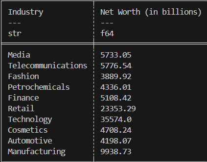

[]https://colab.research.google.com/drive/1BquzAsvqQVaUY1GsUJPwor5qsl9jaWaB?usp=sharing 

# Polars Descriptive Data Set hosted on Google Colab! 

###
Follow this link for the the cloud-hosted Data Manipulation : https://colab.research.google.com/drive/1BquzAsvqQVaUY1GsUJPwor5qsl9jaWaB?usp=sharing 

The purpose of this project is to create a Juypter Notebook that utilizes Polars  to generate descriptive statistics. It establishes an environment on codespaces and uses Github Actions to run a Makefile for : make install, make test, make format, and make lint. It loads the Top Wealthiest data set from Kaggler and utiize a library to run functions that will generate a pie chart as well as some summary statistics about the data.

### Important files include

1. Makefile - needed for installation, formatting, testing and linting

2. Dockerfile - defines the environment ensuring this program will run the same for all devices

3. A base set of libraries - needed to run the functions

4. Group of  format, install, lint and test .yml files to ensure continuous integration and continous development

5. A brand new library made specifically for this project 

6. A Jupyter Notebook with all the code formatted separately for use. 

7. A link for the cloud-hosted notebook version of this data manipulation

The data we will be analyzing will be from Kaggle.com. We will be analyzing the top 1000 wealthiest people in the world. (https://www.kaggle.com/datasets/muhammadehsan02/top-1000-wealthiest-people-in-the-world)

### Click the link for the Demo Video 

https://youtu.be/kKU0yW3wxLg?si=BNhBrNWFR40EI4DD

## FINDINGS

See the sample chart below  of percentages of wealth per each industry described in the dataset 

### From here we can see that Technology is the most lucrative of indsutries to immerse oneself in... I guess it's a lucky thing that we're studying Data Science! 

## The summary Statistics are as follows 

